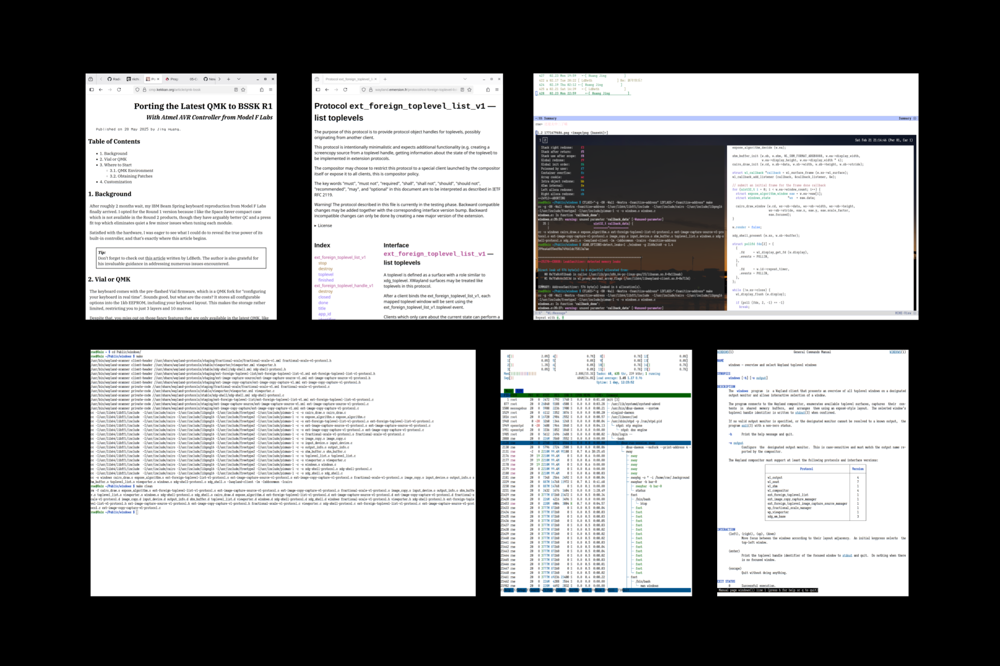

windows is an exposé-style overview tool for selecting windows to operate on in Wayland compositors.

The program presents snapshots of all foreign toplevels (aka, windows) on a chosen output, allows keyboard navigation, and prints the selected toplevel handle identifier to standard output.

It is the successor to [exposway](https://github.com/RadioNoiseE/exposway), with improvements including:

* multi-seat (and hot-plugging) support
* corrrect keyboard repeat handling
* proper fractional scaling
* window adjacency graph caching
* protocol-native snapshot capture (no IPC or grim)

## Installation

windows has tiny footprint. The only dependencies are cairo, xkbcommon, and wayland-protocols (only required when compiling from source).

> [!Note]
> Your Wayland compositor must support ext_foreign_toplevel_list_v1 and ext_foreign_toplevel_image_capture_source_manager_v1.
>
> swayWM supports these since [commit 170c9c9](https://github.com/swaywm/sway/commit/170c9c9525f54e8c1ba03847d5f9b01fc24b8c89) (after the 1.11 release).
>
> riverWM currently lacks support for the latter one, though it is [an accepted proposal](https://codeberg.org/river/river/issues/1270) awaiting implementation.

To build from source, clone this repository and run make. A man page is available for detailed reference:

    man ./windows.1  # or install to $MANPATH/man1/

## Intended Use

windows is designed to integrate with compositor workflows. A common use case is jumping focus to the selected window. Under swayWM, this can be implemented as:

    swaymsg -t get_tree | jq ".. | objects | select(.foreign_toplevel_identifier==\"$(windows -o eDP-1)\") | .id" | xargs -I? swaymsg [con_id=?] focus

Replace eDP-1 with your output name. A [demonstration video](https://youtu.be/4sGfl2vkzLE) is available on YouTube.
